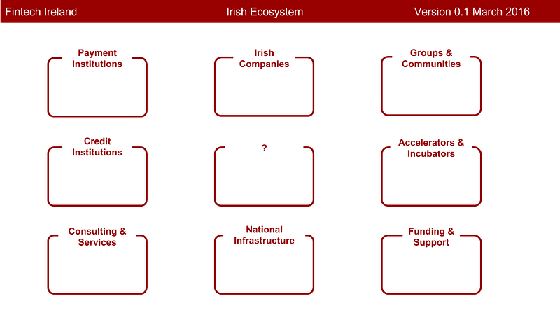

In my previous post [What is Fintech Ireland](https://medium.com/%40supergingerdave/what-is-fintech-ireland-ebcce3bde211), I collated a list of Irish Fintech companies, and got some great feedback from the Fintech community. Here’s version 0.2 of the Irish Fintech Company map:

Irish Fintech Companies v0.2

I also received several comments that Irish Fintech is not just a list of Irish companies. And this is absolutely correct. So it seems like the next step is to map out the ecosystem, and that sounds like a pretty big task!

Which parts of the ecosystem are you interested in? Which areas can you help to map? I need your help to figure out where to go next.

Where next? [You decide](https://davesurvey.typeform.com/to/Z6MhGO)!
