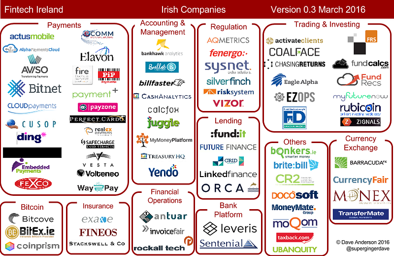

New in this version:

* Aviso - [aviso.io](http://Aviso.io)
* Bitex - [bitex.ie](http://bitex.ie)
* Bitnet - [bitnet.io](http://www.bitnet.io)
* Britebill - [britebill.com](http://britebill.com)
* First Derivatives - [firstderivatives.com](http://www.firstderivatives.com/)
* FRS InvestPro - [frsltd.com](http://frsltd.com)
* Leveris - [leveris.com](http://leveris.com)
* Monex - [monexfs.com](http://www.monexfs.com)
* Moqom - [moqom.com](http://moqom.com)
* My Money Platform - [mymoneyplatform.com](http://mymoneyplatform.com)
* Orca Money - [orcamoney.com](http://orcamoney.com)
* Rockall Technologies - [rockalltech.com](http://www.rockalltech.com)
* Rubicoin - [rubicoin.com](http://rubicoin.com)
* Sentenial - [sentenial.com](https://www.sentenial.com)
* Sysnet Global Solutions - [sysnetgs.com](http://sysnetgs.com)

You’ll spot a few companies that are based in Belfast. Yep, I’m including Belfast in the definition of Irish Fintech Companies.

Thanks to everyone who responded with comments, corrections and support. I have a backlog of a dozen companies to be reviewed and added, so sorry if you didn’t make it on this version — you’ll be on the next one!

At this stage I trust everyone is shown on the ecosystem map, but if you spot an omission (or someone who oughtn’t be there), please do let me know.

Enjoy the easter eggs!
