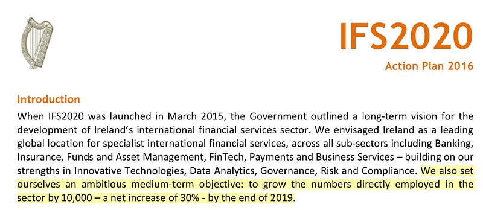

If you’ve been sitting there thinking (during the ad break for the Emmerdale omnibus perhaps), what is Ireland’s strategy for International Financial Services sector – then today is your lucky day.

In 2015 a group of smart people were assembled by Simon Harris TD to come up with a strategy. Simon Harris is, as you know, Minister of State at the Departments of Finance PER and Taoiseach with Special Responsibility for the OPW, Public procurement, and International Banking (incl IFSC). Floods and Financial Services, basically.

As a result, the [International Financial Services 2020 Strategy](http://www.finance.gov.ie/sites/default/files/IFS2020.pdf) was published in March 2015.

A strategy alone isn’t very useful without tangible actions. So every year the Department of Finance publishes an action plan. Here’s an excerpt from the [2016 action plan](http://www.finance.gov.ie/sites/default/files/IFS2020%20Action%20Plan%202016.pdf):

Ok. That’s a good, specific objective. Let’s take a look at how this will be achieved. Here are the two actions relating to the jobs objective:

Hmm. Looks like this objective is sitting squarely on the shoulders of [SmartFutures](http://smartfutures.ie) and [Slingshot Academy](http://www.slingshot.ie).

> Smart Futures is a collaborative government-industry-education programme promoting science, technology, engineering and maths (STEM) careers to second-level students.

> Slingshot was created by a group of college students in July 2014. Our purpose is to create a movement where college students can simply meet and mentor 15 – 19 years in the areas of STEM, (Science, Technology, Engineering, Maths), Finance & Entrepreneurship.

This seems pretty good. We need a steady stream of young people entering the industry. It does seem a little optimistic that these two organisations could deliver in this task alone.

What about mid and senior level roles? Experts and leaders? If we are to attract these type of people into Financial Services before 2020, how will we do that?

Whoa, steady on.

But maybe rapid action isn’t needed? Let’s take a look at how one part of the industry is evolving.

Oh dear. Every year we’re losing a thousand jobs in banking.

I’m not sure I want to wait for IFS2020 to fix this.

Do you?
