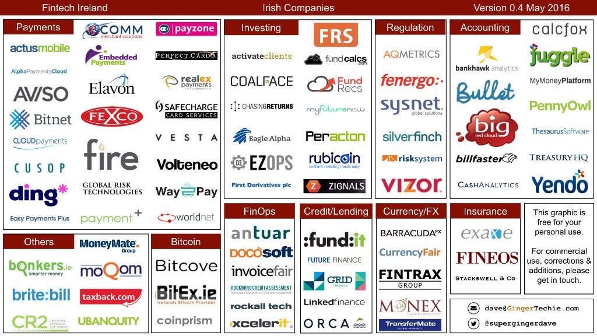

It’s been a while since the last version of this map. One reason is that it’s very time-consuming to search, catalog and verify companies details. The good news is that you can be confident in this information\*. The other reason is that I’m doing some really fun work with [Ammeon](http://www.ammeon.com), a private cloud integrator, which hasn’t left much time for this!

Anyway, enough excuses.

The new additions to version 0.4 of the map are:

* Big Red Cloud — [www.bigredcloud.com](http://www.bigredcloud.com)
* Fintrax — [www.fintrax.com](http://www.fintrax.com)
* Global Risk Technologies — [www.globalrisktechnologies.com](http://www.globalrisktechnologies.com)
* PennyOwl — [www.pennyowl.com](http://www.pennyowl.com)
* Peracton — [www.peracton.com](http://www.peracton.com)
* Rockboro Analytics — [www.rcali.com](http://www.rcali.com)
* Thesaurus Payroll — [www.thesaurus.ie](http://www.thesaurus.ie)
* WorldNet — [www.worldnettps.com](http://www.worldnettps.com)
* Xcelerit — [www.xcelerit.com](http://www.xcelerit.com)

So here’s version 0.4 of the Irish Fintech Companies map.

You can find this and all other maps at [gingertechie.com/fintech](https://www.gingertechie.com/fintech)

As always, there are companies missing from this list. Maybe there are companies who shouldn’t be here? Or maybe you’d like to use this in your publication? Get in touch: dave@*Ginger*Techie.com or on twitter at [@supergingerdave](https://www.twitter.com/supergingerdave)

\* Well, except for the fake company that I inserted. If you’re thinking of reusing this map commercially, you might want to remove that one :)
