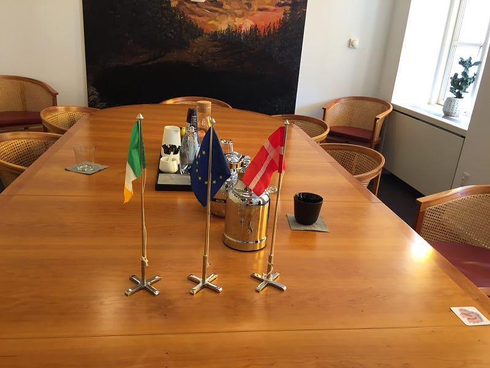

### Gettin Hygge with It — Part 2

This is the second part of my story about why I’m helping to connect the Fintech communities in Ireland and Denmark. If you missed part 1, you can [read it here](https://blog.gingertechie.com/gettin-hygge-with-it-82ec00d2b027#.mfcgr1284).

In the tech world, we like t-shirts. They’re practical, unfussy and there’s an endless supply of them from meet ups, conferences and events. I’ve heard Fintech described as a “meeting of suits and t-shirts” and that sounds like a pretty good description to me.

But enough about dress code, and onto the initial meeting between Fintech Ireland and Fintech Copenhagen. It was a somewhat informal affair (if you exclude the royal marching band — see [part 1](https://blog.gingertechie.com/gettin-hygge-with-it-82ec00d2b027#.mfcgr1284)). And the flag ceremony.

OMFG THERE ARE EVEN LITTLE ROPES FOR RAISING THE FLAGS!

It turns out that Fintech entrepreneurs are hiding in plain sight, and this was certainly true for my host Kim Vindberg-Larsen. Apart from being a key member behind Copenhagen’s Fintech Innovation and Research group [CFIR](https://www.cfir.dk), Kim is the founder of [MeeWallet](http://meewallet.com) — a very innovative payment application, which also runs on an entirely new scheme. If you set up a new payments scheme, you can call yourself a disruptor.

I had recently organised a rapid networking event for the Fintech community in Dublin (“Fintech Speed-Dating”) and this idea seemed to resonate with us both. Why not connect both of our Fintech communities together?

### Building a Brygge

And so, on that sunny afternoon in Copenhagen, Kim and I hatched a plan to create an event that connected our local fintech people with each other.

“Fintech? Isn’t that about Finland?”

The populations in Ireland and Denmark are both quite small (x and y respectively) so we naturally look to international markets. We’re sometimes overlooked by our larger neighbours. So why not build some relationships between our startups, investors, entrepreneurs and tech talent? Sounds easy?

### A Bridge, A Battle, A Band of Collaborators

Luckily, we weren’t alone in this endeavour. The collaborators in [FintechIreland](https://www.fintechireland.com) and [Copenhagen Fintech](https://www.cfir.dk) stepped up to meet the challenge. Which is good, because it turns out that organising an event in two places at once can be tricky …

Our event space was the foundation, so we were delighted when [DogpatchLabs](https://www.dogpatchlabs.com) came on board. And even more delighted that [UlsterBank Ireland](https://www.ulsterbank.ie) were able to sponsor the location, so that we could keep the event free.

Next came the networking and startup segments of the event. And that’s where we added a little twist of creativity.

### #FintechBridge

As an former engineer, networking at events is inefficient, sub-optimal, broken. I want to meet the people that I can help, or who can help me. this isn’t the pub, for swapping stories and idle chat. OK, maybe it’s not so cold, but at the same time who hasn’t gotten frustrated trying to connect with thirty, fifty, a hundred people at an event and you only get to meet two or three.

FintechBridge is networking turned up to [eleven](https://www.youtube.com/watch?v=KOO5S4vxi0o). Publish your details ahead of the event — using the magic link you received from our email — and use Doodle’s awesome [MeetMe](http://doodle.com/meetme) page to arrange dozens of meetings easily.

Follow @fintechbridge on Twitter for updates.

### #FintechBattle

Pitch competitions: [Tired or Expired](https://www.wired.com/2012/12/wired-tired-expired/)? You pitch to a bunch of suits who wouldn’t know innovation if it kicked them in their digital assets. No, we’re not doing that.

For our #FintechBattle pitch competition we’ve got six companies under two years old. A five minute pitch each. But this time the judges are different. The judges are YOU.

No, not you

Attendees will be voting on Twitter using an X-Factor style system. Tweet:

> #fintechbattle 1

to vote for Company 1. Or use 2 for Company 2. And so on, up to Company 6. You can vote as many times as you like, but only one vote per Company will be counted.

Behind the scenes, our crack team of Fintech data scientists will crunch the numbers and announce the decision: not one winner, but two.

The best company from each location wins a subsidised trip to the opposite location to meet with partners, investors, experts and more.

For those of you thinking about indulging in a little light cheating, I’d like to remind you that we have the former Director of Criminal Enforcement from the Central Bank of Ireland present. And, just like Santa, he knows if you’ve been bad or good. So you better not cheat, for goodness sake.

Follow @fintechbattle on Twitter for updates.

### The Fintech Future

Where is this all going, I hear you ask? What’s coming up in 2017?

Is this a first in a series of events? Maybe.

Are there more events focused on a particular area of Fintech? Probably.

Will I be arriving at your office tragically underdressed, hoping to build connections with your Fintech community? Absolutely!

