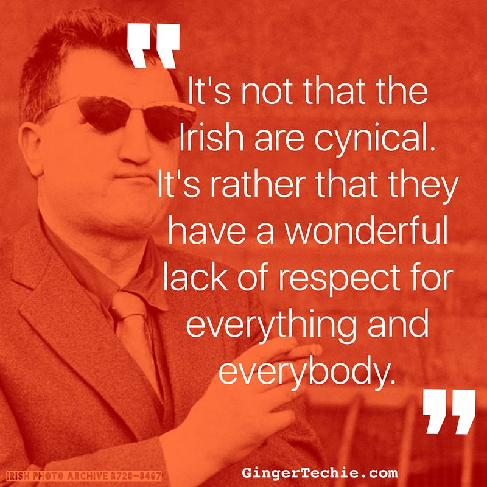

### Ireland’s Fintech 20

Uh-oh. Here’s another one of those lists. Top 50 influencers. Hot 100 innovators. The 37 Fintech Upstarters You Simply Need To Know About.

Ok, dear reader, set aside your cynicism and strap on some seasonal goodwill. I’m going to tell you why this is important, and why you should give a sh1t.

---

In Ireland we’re great at some things, but there’s one skill where we’re truly world-class.

Cynicism. If there was an Olympics for cynicism, we’d take gold, silver and bronze. And yes, there would be a ticket scandal, but it would turn out that the money was just [resting in our account](http://fatherted.wikia.com/wiki/Ted_Crilly).

Ok so we’re not your high-fiving, wide-eyed silicon valley cheerleaders, changing the world to be a better place and hitting gazillion dollar valuations in mere days. It’s not for us, Ted.

But at the same time, when you scratch beneath the shiny veneer, when you look deeper, you’ll discover something surprising. We’ve the same talent, the same experience and the same hunger.

No wait, we’re more hungry, by far. I spoke to one founder this week who got up at 4:45am every week for three months, to travel to an accelerator programme. Show me a valley brogrammer with that level of commitment. Show me founders as hungry as ours.

---

Recently, the outgoing [Startup Commissioner for Dublin](http://www.startupdublin.com/) spoke about our ambition, and the perception that we’ll never breed Unicorns here. I guess we forgot about Fleetmatics? I suppose we forgot to look at the data, to look into the ecosystem at the numbers of growing companies, across a widening group of disciplines. I suppose, because it’s a pure numbers game, we got lazy and let our overriding cynicism take over, and talk down our successes.

Luckily, folks like [Dave McClure](https://medium.com/u/ed0a2ab3c5be) sometimes remind us how to [farm Unicorns](https://www.slideshare.net/mobile/dmc500hats/farming-unicorns-building-startup-investor-ecosystems-dublin-june-2016/2-Dave_McClureFounding_Partner_500_Startups00s).

Anyone who ever worked a sales funnel will recognise this challenge. You’ve got to just keep on grinding through, pump in those new leads, learn from the losses (and the wins). You put your cynicism aside and take each opportunity as it comes. Each loss makes us hungrier, each win gets us closer to that vision that gets us out of bed every day.

---

It’s easy to be cynical about the Fintech 20. We can dismiss the efforts of these young companies, who are out there to make a difference in some small part of financial services. It’s easy to roll our eyes and criticise the selection process, the attendance, the venue, the free food and booze (ok, nobody ever criticises free drink).

But I hope that you can rise above your natural instinct for cynicism and instead talk about what’s working. Sure, give constructive feedback. Try. Improve. Teach. Learn. Iterate. [Fail better](http://www.slate.com/articles/arts/culturebox/2014/01/samuel_beckett_s_quote_fail_better_becomes_the_mantra_of_silicon_valley.html). Use your superpowers for good.

(C) [Irish Tech News](http://irishtechnews.net/)

Reach out to one of these companies and connect them with a new customer. Tell them about a great channel partner. Give them the benefit of your experience or expertise.

Either that, or feck off ya old cynic :)

**Update 19/12/16**: Eagle-eyed Shane Brett pointed out that the photo I included was the runners-up, not the actual Fintech 20. What’s my biggest strength? Attention to detial.

