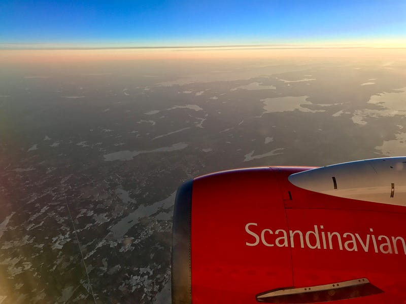
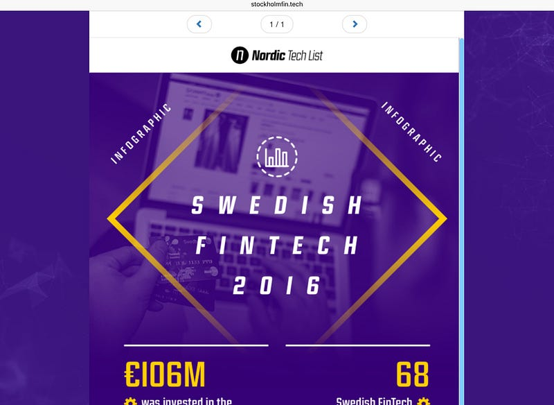
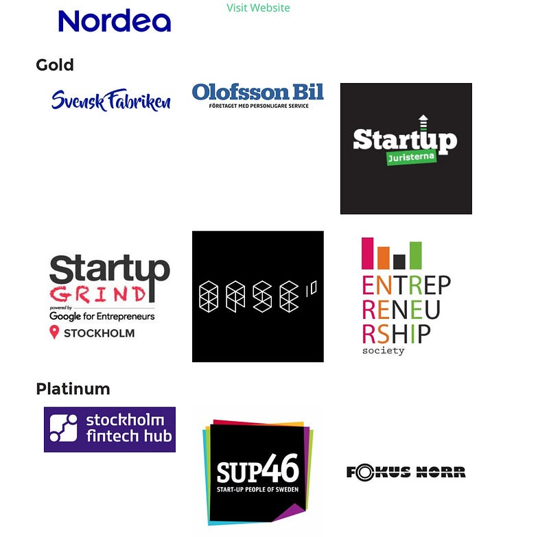

### Fika, Fintech and Just Feckin Doing It

Consider, if you would, the humble tea break. It’s is the foundation upon which modern Irish business is built. Work gets divided into two piles – before tea and after tea. Allegiance to one brand or another is both steadfast and lifelong. [The Irish drink more tea per perso](http://qz.com/168690/where-the-worlds-biggest-tea-drinkers-are/)n than any other country except Turkey, putting even our British neighbours to shame. So you’d think we’d be #1 in an international ranking of tea break sophistication, right?

Wrong.

There’s another country who have taken the tea break to the next level. And they even had the audacity to gave it a name. *Fika*.

Yes, it’s the flat-pack-designing, high-cheekbone-having, meatball-munching Swedes.

But wait a second, what’s this about “Kaffe”? Haha! You can’t have a tea break with coffee! So Fika is totally different. Phew, stand down.

But that got me thinking …

### You say FINtech, I say *FinTECH*

In Fintech we’re obsessed with categories and naming things. Are you in Fintech? Or Regtech? Or perhaps you’re Insurtech? Well no need for you to connect with PaymentsTech. Doing something with cryptocurrencies? Keep away from those fund management folks. So off we go, splintering into ever more niche groups. Which is fine. Except if you’re the [Judean People’s Front](https://en.wikipedia.org/wiki/Monty_Python%27s_Life_of_Brian).

With all this splintering, it’s hard to keep track of what’s going on. The usual solution to this is some kind of association or hub, to act as a central point for news, events and collaboration. That’s the approach we’ve taken in Ireland. Although instead of having one central point, we have several, with a new “umbrella brand” IFSIreland recently launched to present a single face outside of Ireland.

I wondered how other countries were managing this. Where better to start than Sweden?

### Stockholm and Fintech

You may be surprised to learn that Sweden is a thriving hotbed of European Fintech innovation, [second only to London](https://letstalkpayments.com/stockholms-fintech-is-europes-no-2-innovation-hub/). The numbers are certainly impressive, and NordicTechList have done a great job collating [this report](http://www.nordictechlist.com/content/reports/Swedish_Tech_Funding_Report_2016.pdf). I arranged to meet the founder, British expat Howard Riminton - in a local Irish bar (of course).

### NordicTechList

With [NordicTechList](http://www.nordictechlist.com), Howard has taken on the challenge of collating information about all the tech companies across all the Nordics, not just Sweden. It’s a fearsome task, as I know from speaking with the team at [TechIreland](https://www.techireland.org/). Not at all daunted by that, NordicTechList have just launched a community app where Fintechies can ask questions, check out the latest news and connect with other innovators.

Fintech is just one of the sectors covered by NordicTechList, but there’s clearly a benefit to reusing this underlying data platform to build sector-specific views.

I went to meet Stockholm Fintech to see if they felt the same.

### Stockholm Fintech (part 1)

Yup.

Meeting with British expat Matthew Argent and the [StockholmFin.tech](http://www.stockholmfin.tech) team, I started to get a sense for the interconnectedness of the Fintech community. And the diversity – with only one native Swede in the room. I wondered, if Sweden was so great at being a Fintech location, why wasn’t an association or hub already in existence?

The simple answer was, nobody did it yet. It’s amazing how many times I hear that. People asking “how come we don’t have x? We really should have x!”. The trick is to just feckin do it! And that’s what Matthew and his team are doing, and with a very impressive vision I have to say. It’s early days for StockholmFintech, but it’s clear they’ve done their homework to understand what works, what their customers and stakeholders need, and just like any other startup they’re 100% focused on executing on that vision.

I’ve left out a bunch of details, because I don’t want to steal their thunder – so you should register for the StockholmFin.tech newsletter for the latest news. You won’t be disappointed.

This is clearly a well-funded operation. But often the view from the grass-roots practitioners is different. I made my way to meet the organiser of the Stockholm Fintech meetup group.

### Stockholm Fintech (part 2)

I met Hassan Mian at the offices of his new company [WillAndSkill](https://www.willandskill.se), located in an impressive waterfront building containing dozens of other innovative companies.

Hassan now looks after the [Stockholm Fintech meetup grou](https://www.meetup.com/Stockholm-FinTech-Meetup)p, in addition to driving his company and chasing opportunities in the Far East. As always, it’s the busiest people that end up leading these groups!

The meetup group has grown to over 750 members, and they’re a diverse bunch – recruiters, investors, bankers, Startups. I wondered what effect the new Fintech group would have – would the meetup shut down? No, not at all, There’s always a need for a less structured place, where people can connect. Different strokes for different folks. Makes sense.

And from the unstructured, to the intense. Is it possible to build a Fintech business in a weekend?

### Fintech StartupWeekend Stockholm

As I write this, the event has just finished. I was delighted that the StartupWeekend organiser [Tetiana Siianko](https://medium.com/%40fun_skier?source=linkShare-eeb2c56b2dba-1485718134), was able to take time out from preparing for the event to meet with me at the United Spaces office, an uber-cool coworking space.

If I remember correctly, this is the first Fintech-themed StartupWeekend in Stockholm. Why? Why not! There’s a large enough community here in Stockholm to support this kind of event, and (spoiler alert) lots of amazing startup people bringing awesome ideas, it just felt right.

Oh, and of course, everyone knows each other – StockholmFin.tech are an event sponsor. Collaboration FTW!

### Conclusion

And so, after two manic days (which included some actual work, by the way! What, you think banks are just gonna fix themselves??) I had met some amazing innovators, entrepreneurs and organisers, and had seen first-hand the enthusiasm and optimism that you see across the city.

The Fintech scene in Stockholm is broad, deep, active, vibrant, diverse – and now, they’re getting even more organised.

If there’s anyone out there who challenges Sweden for the Fintech #2 spot, I urge you to get in the ground in Stockholm and see for yourself. Because I think if they set their sights on the #1 spot, they’re gonna be pretty damn hard to beat.

Thanks to Tetiana Siianko, Howard Riminton, Hassan Mian and Matthew Argent for being so accommodating to a random stranger from Ireland!

