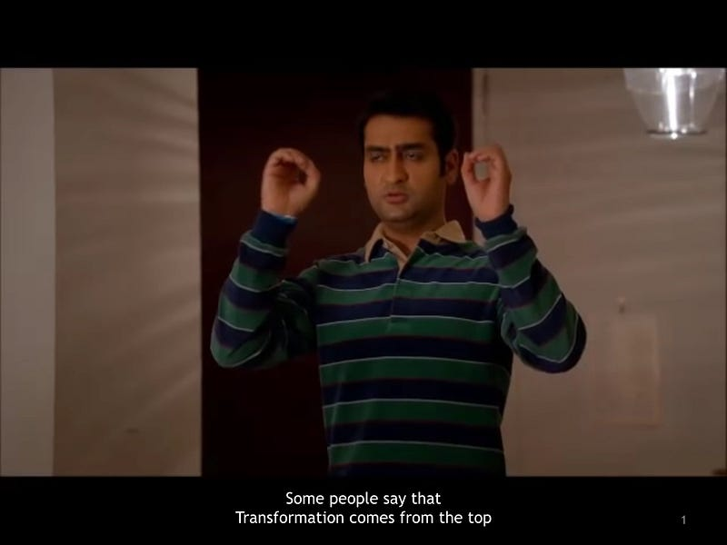

What if I told you you are doing Digital Transformation wrong?

Many people say that transformation comes only from the top.

But others are convinced that Transformation starts from below.

But, what if …

What if transformation is *middle*-*out*?

---

Here at GingerTechie, our transformations have achieved a Weissman score of over 5.1

We’re ready and waiting for your fax.

