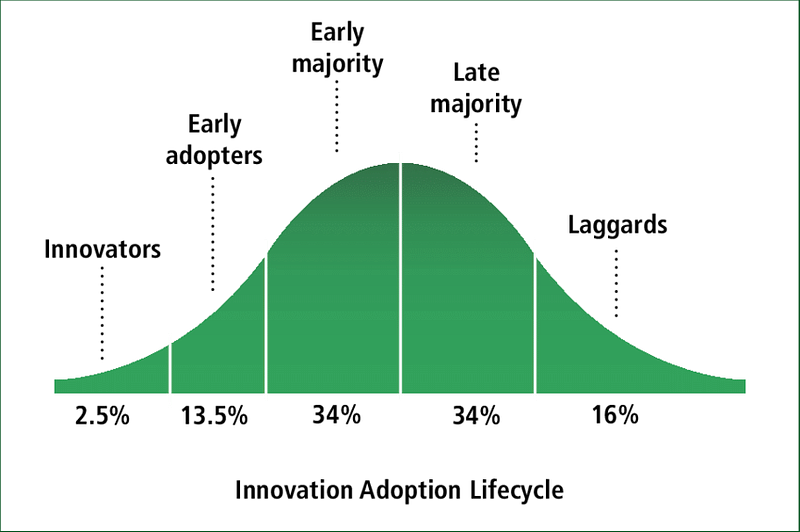
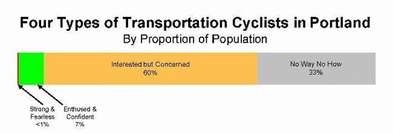
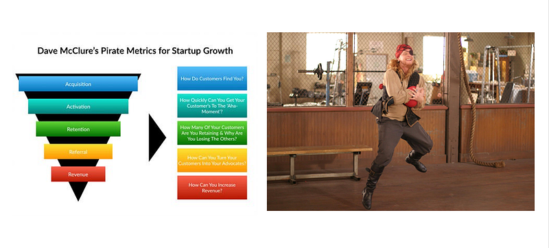
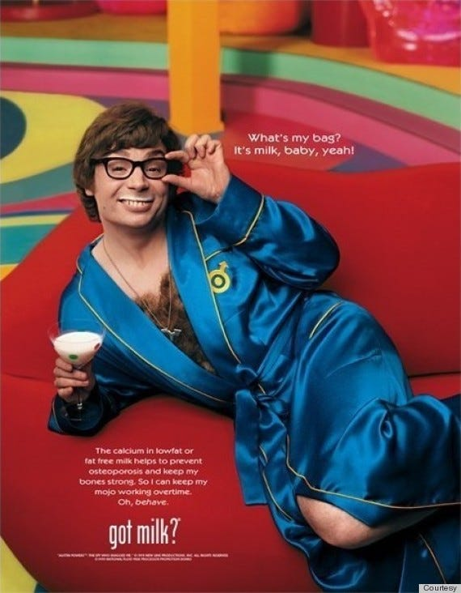
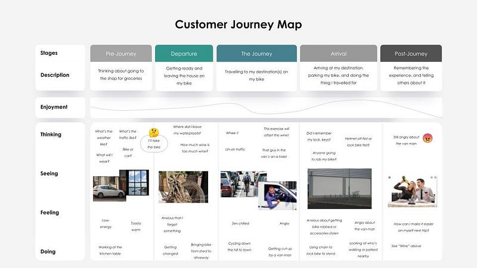

### Cycling: A True Underdog Story

This is a follow up to my [previous article](https://blog.gingertechie.com/product-management-for-public-good-8adc8feb8c52) on cycling advocacy and product management. No sequel is as good as the original, and this will be no exception (but the special effects will be **a***m***a***z***i***n***g)**

Typical underdogs

I suppose I’ve always gravitated toward the underdog. As a ginger nerd, and therefore one of life’s natural winners, I’m not sure why this is the case 😐

So when I rekindled my interested in cycling, it was like slipping on an old familiar jersey, albeit one that’s now embarrassingly tight around the midriff. (which is surely the fault of the washing machine, rather than my pristine lifestyle). Cycling is, at the time of writing, an underdog activity in Ireland. It’s something reserved for radicals and weirdos and the fringes of society. I know, hard to know how I fit in with all that, but stay with me.

This got me thinking about the parallels of working with new companies, or “*startups”*. Maybe there are similarities …

### **Vision**

The founder(s) of a startup have a vision of the future where their product or service changes the world for the better. Often the vision is so different to how things are now, it sounds radical, even crazy. When you hear that the vision of cycling is to get people out of their cars (the pinnacle of transport evolution) and onto bikes, it sounds a little … odd. And that’s a *good thing*.

> If, by some miracle, a prophet could describe the future exactly as it was going to take place, his predictions would sound so absurd, so far-fetched, that everybody would laugh him to scorn — Arthur C. Clarke

Sounding crazy is actually a pretty good yardstick by which to measure a big vision. Take some of these:

* **AirBnB** — pay to sleep on an airbed in the home of a complete stranger
* **Uber** — summon a random internet person to pick you up in their car
* **Twitter** —write blogs, but limited to the size of a text message

How do you feel when you hear that we’ll all be whizzing around on bikes in the next few years? Crazy enough that it might just work?

### **Resources**

Despite having these diverse, wacky ideas, startups like these have another thing in common: they start with nothing.

I know what you’re thinking: isn’t cycling hugely well-funded?

Surprisingly, no. You’d think that with all the talk about climate change, that the Government would be pouring money into cycling as one of the best ways to reduce harmful emissions. But that’s not all, because cycling also improves physical and mental health, provides new income from tourism as well as reducing traffic.

Bike Life Report 2020, NTA

The Bike Life report published in 2020, covering the UK and Ireland, estimates a **net benefit to society of €1 for every kilometre cycled instead of driven**.

The best ideas don’t always attract investment. On the flip side, ideas that attract investment aren’t always the best (cf. the company I founded, [Plynk](https://www.wired.co.uk/article/plynk-p2p-payments-messaging-app-series-a-funding))

### Market Share

Startups want to reach everyone in their target market, so that everyone uses their product. They start from a cool 0% market share, where nobody has ever heard of them, and from there it’s a long hard slog to spread the word and they become mainstream and turn into The Man.

Traditionally, customers were segmented into groups who would adopt the new product, looking something like this:

Via [Michael Batko](https://medium.com/u/5cb88051968f)’s excellent summary of”Crossing the Chasm”

How does this model compare with adoption of cycling?

The Four Types of Cyclist, [City of Portland](https://www.portlandoregon.gov/transportation/article/158497)

Hmm. Sounds familiar?

* Innovators — “Strong and fearless”
* Early Adopters — “Enthused and Confident”
* Early Majority — “Interested but Concerned”
* Laggards — “No Way No How”

If we can think about the residents of an areas as being our “market”, and we can segment them into how likely they are to adopt cycling, could there be similarities in how to attract customers? Could we focus on the innovators and early adopters in order to eventually reach the mainstream?

### Growth

About a million years ago, in 2007, a venture capitalist named Dave McClure created a framework for market growth with a few key stages: Acquisition, Activation, Retention, Referral and Revenue, or AARRR.

Pirate Metrics, Steve the Pirate

Some of the early steps translate pretty well into the world of cycling advocacy. We’re trying to find new people and rally them to the cause. And even in the later steps, you could think about a cycling person influencing their family or friends as “Referral”.

But what about “Revenue”? We’re not selling bikes, we’re selling the concept of cycling. How on earth do you get revenue from that?

When a customer buys a product, they pay the startup. When startups get more revenue, they can hire more people, spend more on advertising, and grow even faster. But when someone cycles, cycling advocacy groups don’t get paid. If 10,000 people bought a bike and started cycling tomorrow, I’m not sure that cycling advocacy groups would gain any benefit at all (though I’d be very happy to be proven wrong!)

I suggest that *gaining active supporters* is the equivalent of revenue for startups. The more people who contribute their time, energy and skills, the more effort that can be applied to “gain market share” and the faster cycling will grow.

### Team

Who are these active supporters of cycling? What makes them tick? Can I continue to stretch this metaphor and compare cycling supporters with startup teams? Dear reader, I think you already know the answer.

In my experience working with startups, the people are:

* Passionate about solving a big problem
* Resilient to repeated setbacks and less-than-comfy conditions
* Unconventional thinkers
* Doers not dreamers
* Distinguishable in a crowd by their dress code
* Posessed by a crazy vision of a better future

Since I’m only just getting to know the cycling community, I can’t speak to whether they share these qualities, but early signs are encouraging.

### Product

Startups innovate. They produce products that are easier to use, faster, cheaper, or work in ways that weren’t previously imagined. On the other hand, cycling advocacy promotes a *mode of travel*— more like a product category than a product. How the hell do you product-manage a *product category*??

The iconic “Got Milk” Campaign, California Milk Processor Board

Ohh, right. Groovy baby!

To be honest, I haven’t quite gotten my head around this yet. In order to try and understand this “product” I drew up a customer journey map, just based on my own limited experience going to the shop for booze.

This seems like a terrible, terrible product experience. Which is great, because at least there’s lots of potential for improvement!

Meanwhile, I’d love to hear from anyone managing and promoting a product *category*. (If anyone would like to suggest a clever slogan for cycling in the vein of “Got Milk?” I regret to inform you that “Got the ride?” is incorrect)

### Conclusion

With this rigorous and scientific (cough, cough, wear a mask) analysis, I have shown that startups are more similar to cycling advocacy groups than they are different.

If you buy this, it follows that it should be possible to take some of the tools and techniques used by startups, and apply them to cycling advocacy.

In my next article, I’ll explain how cycling advocacy is actually like working in a large corporation. No, really.

